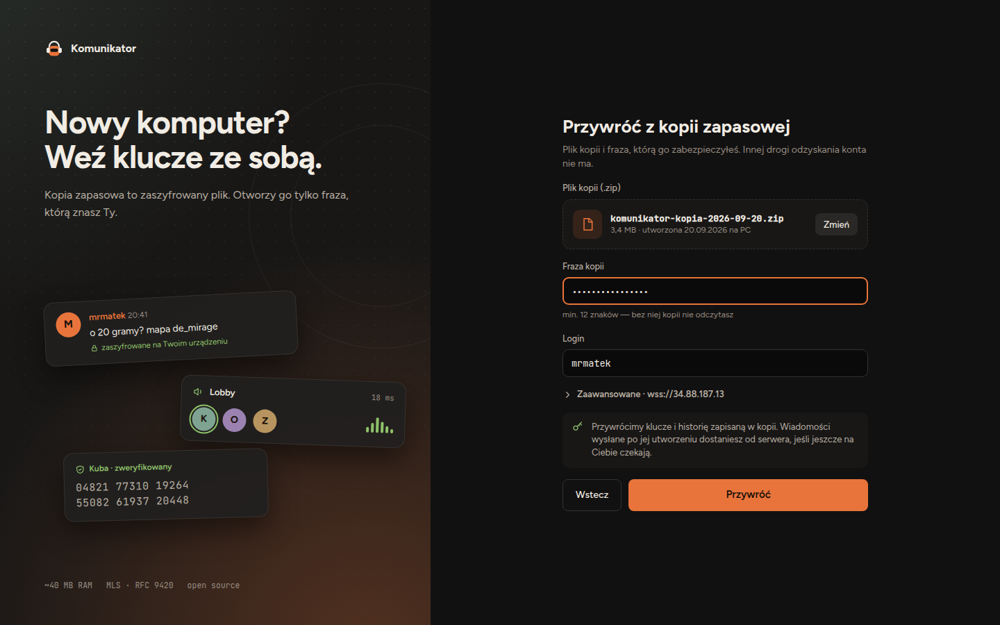

A backup is an encrypted .zip file containing your keys and history. Only the phrase you set when creating the backup can open it. The server has neither the file nor the phrase — that’s why an account can’t be recovered by email.

1. **Install Komunikator on the new computer**

   Download the app from the [Download](/download/) page and launch it.

2. **Choose “Restore from backup”**

   The button is on the login screen, below “Log in”.

   

3. **Select the .zip file and enter your phrase**

   The phrase is at least 12 characters long. It’s case-sensitive.

4. **Set a PIN and you’re done**

   Conversations from the backup appear straight away, and newer messages arrive from the server if they’re still waiting for you.

> **Forgot your phrase?** Without it, the backup can’t be opened — not even by us. If you still have another device logged in, create a new backup from it.
