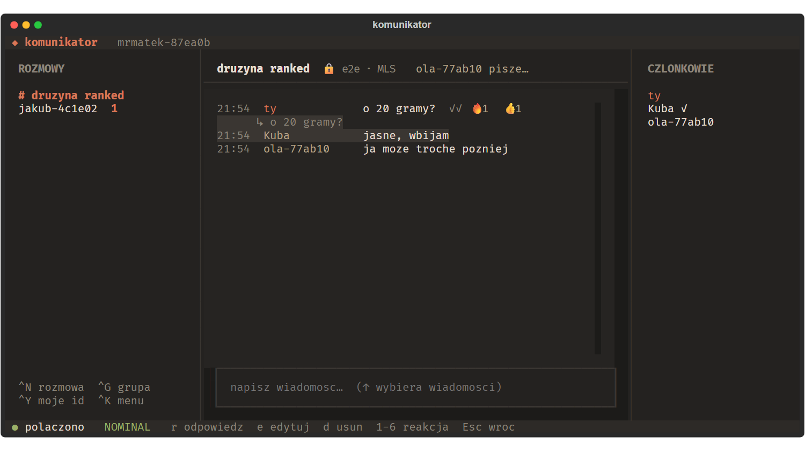

## Co potrafi

- **Rozmowy 1:1 i grupy** szyfrowane end-to-end protokołem MLS (RFC 9420). Tworzenie grup, dodawanie i usuwanie członków, własne nazwy grup i kontaktów.
- **Czat jak zwykle:** odpowiedzi, edycja, usuwanie, reakcje, ✓ wysłano / ✓✓ przeczytano, „pisze…”, nieprzeczytane, wyszukiwanie i starsza historia. **Pogrubienie**, `kod`, linki i emoji (`:fire:` zamieniane przy wysyłce).
- **Głos:** **F7** dołącza do rozmowy albo z niej wychodzi, **F8** wycisza, a push-to-talk działa jako klawisz przełącznika.
- **Bezpieczeństwo:** każde żądanie podpisane kluczem urządzenia, numery bezpieczeństwa do weryfikacji rozmówcy, ostrzeżenie przy zmianie klucza, PIN szyfrujący sekrety w sejfie systemowym i kopia zapasowa chroniona frazą.
- **Niezawodność:** kolejka wiadomości offline, wznawianie bez duplikatów i tryby serwera. Rozjechany zegar nie przeszkadza — żądania używają czasu serwera.
- **Wygląd:** motywy ciepły, jasny i AMOLED, widok zwarty, obsługa myszy i powiadomienia bez treści, gdy ustawiony jest PIN.

## Skróty klawiszowe

| Skrót | Działanie |
| --- | --- |
| `Ctrl+N` / `Ctrl+G` | nowa rozmowa / nowa grupa |
| `↑` w pustym polu | wybór wiadomości: `r` odpowiedz, `e` edytuj, `d` usuń, `1`–`6` reakcja |
| `Ctrl+E` | emoji |
| `Ctrl+F` | szukaj w rozmowie |
| `Ctrl+R` | zmień nazwę rozmowy lub kontaktu |
| `Ctrl+S` | numery bezpieczeństwa |
| `Ctrl+Y` | kopiuj mój identyfikator urządzenia |
| `Ctrl+,` | ustawienia |
| `Ctrl+K` | menu: członkowie grupy, PIN, kopia zapasowa i reszta |
| `Ctrl+L` | wyloguj (usuwa klucze i historię z tego komputera) |

## Wymagania

- Windows, macOS albo Linux — jeden plik wykonywalny, ok. 22 MB
- Ok. 50 MB RAM
- Sejf systemowy: Menedżer poświadczeń Windows, Pęk kluczy macOS albo Secret Service w Linuksie

Na Windows plik uruchomiony dwuklikiem sam otwiera się w Windows Terminal, jeśli jest zainstalowany.

## Po co klient w terminalu?

Bo część z nas mieszka w terminalu. Jest lekki, działa przez SSH na serwerze albo Raspberry Pi i sprawdza się jako drugie okno w trakcie gry. Wolisz pełną aplikację graficzną? [Pobierz aplikację na komputer](/pl/pobierz/).
